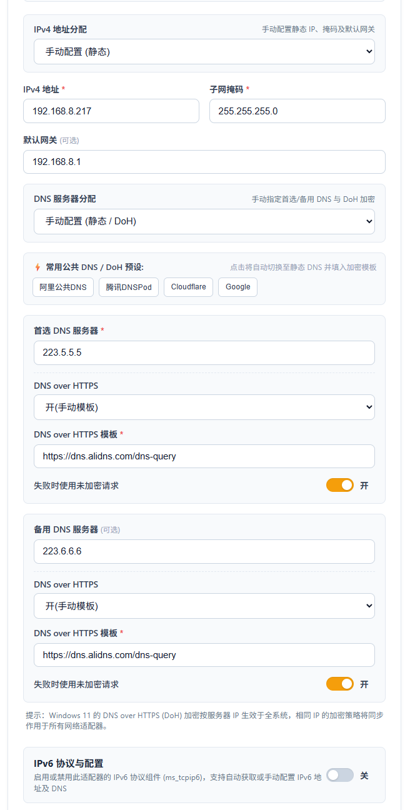

# Windows 网络配置工具 (Windows Network Config Tool)

# Windows 网络配置工具


一款基于 **Vue 3 + TypeScript + Rust + Tauri** 开发的 Windows 网络配置工具。

用于管理 Windows 网络适配器的 IPv4、IPv6、DNS 与 DNS over HTTPS（DoH）配置，并提供配置校验、失败恢复、历史记录等功能。

------

## ✨ 功能介绍

### 🌐 IPv4 / IPv6 配置

支持分别管理网络适配器的 IPv4 和 IPv6 配置。

可以针对不同配置项选择：

- **保持现状**
- **自动获取**
- **手动配置**

IPv4 地址、IPv4 DNS、IPv6 地址和 IPv6 DNS 可分别设置，程序只修改用户明确选择的配置项。

### 🔒 DNS over HTTPS（DoH）

支持 Windows 系统级 DNS over HTTPS 配置。

主要功能包括：

- 常用公共 DNS 服务器预设
- DoH 自动升级模式
- 自定义 DoH HTTPS 模板
- 明文 DNS 回退配置

### 🛡️ 配置失败恢复

在修改网络配置前，程序会保存当前网络适配器的相关状态。

如果配置过程中发生失败或超时，程序会尝试按照保存的状态恢复相关配置，并重新读取系统中的实际网络状态进行核验。

> 网络配置涉及 Windows 多个系统组件，因此恢复过程仍可能受到操作系统状态、驱动程序或第三方网络软件影响。

### ⚡ 静默执行系统命令

底层调用 PowerShell、`netsh` 等系统工具时使用无控制台窗口方式运行，避免执行网络配置过程中频繁弹出命令行窗口。

同时使用 Windows Job Object 管理相关子进程，降低命令超时或程序异常退出后遗留后台进程的可能性。

### 🔐 管理员权限检查

修改 Windows 网络适配器、IP 地址和 DNS 配置通常需要管理员权限。

程序会在执行写操作前检查当前权限。如果权限不足，将阻止相关操作并提示用户使用管理员权限运行程序。

### 🔄 多种网络适配器兼容

程序对部分特殊网络环境进行了兼容处理，包括：

- IPv6 被禁用的网络适配器
- 虚拟网络适配器
- IPv4 / IPv6 状态不完整的网络环境

当 IPv6 查询不可用时，程序会进行容错处理，尽量避免影响 IPv4 和 DNS 配置功能。

### 📝 配置历史与编辑草稿

支持保存最近 **10 条有效网络配置记录**。

切换不同网络适配器时，当前正在编辑的内容会暂时保存，减少重复输入。

------

## 📸 界面预览

<div align="center">
  
  &nbsp;&nbsp;
  
</div>

------

## 📦 下载

当前版本：

**v0.1.0**

当前提供 **Windows x64** 构建。

预编译程序位于：

```text
releases/
```

| 文件                                      | 类型   | 说明                                                     |
| ----------------------------------------- | ------ | -------------------------------------------------------- |
| `Windows网络配置工具.exe`                 | 便携版 | 无需安装，可直接运行                                     |
| `Windows_Network_Config_Tool_v0.1.0.exe`  | 便携版 | 与中文版文件名的便携版本内容一致，便于英文环境或脚本调用 |
| `Windows网络配置工具_0.1.0_x64-setup.exe` | NSIS   | Windows 安装程序                                         |
| `Windows网络配置工具_0.1.0_x64_zh-CN.msi` | MSI    | Windows Installer 安装包，可用于标准化或企业部署         |

### 文件完整性校验

发布文件的 SHA-256 校验值位于：

```text
releases/SHA256SUMS.txt
```

构建输入信息及相关发布元数据位于：

```text
releases/release-manifest.json
```

------

## 🚀 使用方法

### 1. 安装 WebView2 Runtime

程序界面基于 Tauri WebView，需要 Microsoft Edge WebView2 Runtime。

Windows 10 / Windows 11 通常已经安装 WebView2 Runtime。

如果程序无法正常显示界面，请检查系统是否安装：

**Microsoft Edge WebView2 Runtime**

### 2. 使用管理员权限运行

Windows 修改网络适配器、IP 地址以及 DNS 设置需要管理员权限。

建议：

1. 右键单击程序；
2. 选择 **“以管理员身份运行”**；
3. 在 UAC 提示中确认授权。

### 3. 选择网络适配器

启动程序后选择需要配置的网络适配器，然后根据需要修改：

- IPv4 地址
- IPv4 DNS
- IPv6 地址
- IPv6 DNS
- DNS over HTTPS

未选择修改的配置项将尽量保持原有状态。

> [!IMPORTANT]
> 修改网络配置可能导致当前网络连接暂时中断。远程连接环境下操作时，请确认具有其他恢复网络配置的方法。

------

# 🛠️ 开发指南

## 环境要求

推荐在 **Windows x64** 环境下进行开发和构建。

需要安装：

| 环境         | 要求                            |
| ------------ | ------------------------------- |
| Windows      | Windows x64                     |
| PowerShell   | PowerShell 7 (`pwsh`)           |
| Node.js      | >= 20                           |
| Rust / Cargo | >= 1.75                         |
| C++ 工具链   | Visual Studio C++ Build Tools   |
| Windows SDK  | 已安装                          |
| WebView2     | Microsoft Edge WebView2 Runtime |

------

## 安装依赖

项目使用 Yarn Classic 安装前端依赖。

在项目根目录执行：

```powershell
npx --yes yarn@1.22.22 install --frozen-lockfile
```

预取 Rust 依赖：

```powershell
cargo fetch --manifest-path src-tauri/Cargo.toml --locked
```

------

## 启动开发环境

运行：

```powershell
npm run tauri -- dev
```

该命令会启动 Tauri 桌面应用以及对应的前端开发环境。

Vite 开发服务器固定监听：

```text
http://localhost:3000
```

> [!NOTE]
> 单独运行 `npm run dev` 只会启动前端 Web 开发服务器。
>
> 浏览器环境无法直接调用 Tauri 提供的原生 IPC 接口，因此涉及网络适配器读取、网络配置修改等功能时，应使用：
>
> ```powershell
> npm run tauri -- dev
> ```

------

# 🧪 测试与代码检查

项目包含 TypeScript 类型检查、Rust 格式检查、Clippy 静态检查、Rust 单元测试以及回归测试。

## TypeScript 类型检查

```powershell
npm run typecheck
```

用于检查前端 TypeScript 类型错误。

------

## Rust 格式检查

```powershell
cargo fmt --manifest-path src-tauri/Cargo.toml -- --check
```

检查 Rust 源代码是否符合 `rustfmt` 格式规范。

------

## Rust Clippy

```powershell
cargo clippy --manifest-path src-tauri/Cargo.toml --locked --offline --all-targets -- -D warnings
```

运行 Rust Clippy 静态分析，并将警告视为错误。

> 使用 `--offline` 前，请确保所需 Rust 依赖已经下载到本地。

------

## Rust 单元测试

```powershell
cargo test --manifest-path src-tauri/Cargo.toml --locked --offline
```

当前测试覆盖包括：

- 网络配置验证
- 并发锁
- `netsh` 参数处理
- 管理员权限检测
- 相关底层网络逻辑

------

## 事务恢复与故障注入回归测试

```powershell
npm run test:regression
```

用于验证网络配置修改失败、异常及故障注入场景下的恢复逻辑。

------

## 功能回归测试

```powershell
npm run test:functional
```

用于验证前端和原生端的主要功能逻辑以及用户配置意图是否能够正确传递和执行。

------

# 📦 构建与发布

## 一键构建

在满足构建环境要求后执行：

```powershell
npm run release
```

该命令用于完成项目发布构建，并生成相应的 Windows 发布文件。

当前发布目标包括：

- 前端生产构建
- Windows 便携 EXE
- MSI 安装包
- NSIS 安装包
- `releases/` 发布文件

也可以运行项目根目录中的：

```text
build-app.bat
```

详细的构建流程、发布文件生成方式以及故障排除方法，请参阅：

[打包说明.md](https://chatgpt.com/c/打包说明.md)

------

# 📚 项目文档

项目包含开发、构建、测试以及已知限制等详细文档。

| 文档                                                         | 说明                                               |
| ------------------------------------------------------------ | -------------------------------------------------- |
| [文档导航中心](https://chatgpt.com/c/docs/README.md)         | 项目文档总索引以及常用命令速查                     |
| [中文开发文档](https://chatgpt.com/c/WindowsNetworkConfigTool_DevDoc_CN.md) | 系统架构、IPC 数据契约、网络配置流程及状态恢复设计 |
| [English Developer Guide](https://chatgpt.com/c/WindowsNetworkConfigTool_DevDoc_EN.md) | English development and architecture documentation |
| [打包发布说明](https://chatgpt.com/c/打包说明.md)            | 开发环境、安装包构建、发布流程及完整性校验         |
| [已知限制与技术边界](https://chatgpt.com/c/docs/known-limitations.md) | UAC、网络配置恢复、DoH 以及 Windows 系统相关限制   |
| [验证记录与测试报告](https://chatgpt.com/c/docs/verification.md) | 单元测试、回归测试、功能验证以及验收记录           |
| [回归测试说明](https://chatgpt.com/c/tests/regression/ipv6/README.md) | IPv6、故障注入及相关回归测试机制                   |
| [MIT License](https://chatgpt.com/c/LICENSE)                 | 项目开源许可证                                     |

------

# 🏗️ 技术栈

项目主要使用：

- **Vue 3** — 前端界面
- **TypeScript** — 前端业务逻辑及类型系统
- **Vite** — 前端开发与构建
- **Tauri** — Windows 桌面应用框架
- **Rust** — 原生系统功能与网络配置逻辑
- **PowerShell / netsh / CIM** — Windows 网络配置与状态查询

------

# ⚠️ 注意事项

本工具会直接修改 Windows 网络配置。

使用前请注意：

- 建议使用管理员权限运行；
- 修改静态 IP 前请确认 IP 地址、子网掩码/前缀长度及网关填写正确；
- 修改 DNS 前请确认 DNS 服务器可用；
- 远程桌面或其他远程管理环境下修改网络参数可能导致连接中断；
- VPN、虚拟机、代理软件以及第三方安全软件可能改变 Windows 网络配置行为；
- DoH 的实际可用情况与 Windows 版本、DNS 服务商以及系统网络环境有关。

------

# 📄 License

本项目基于 **MIT License** 开源。

详细内容请参阅：

[LICENSE](https://chatgpt.com/c/LICENSE)
