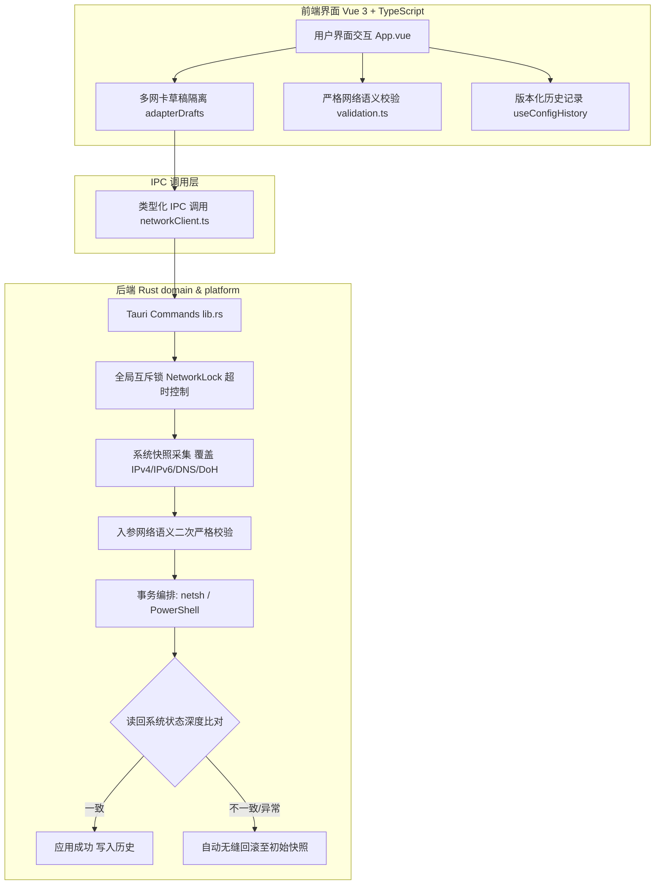

# 🚀 Windows 网络配置工具 (Windows Network Config Tool)

[](LICENSE)
[](#)
[](#)
[](releases/)

> 💻 **安全、可靠、现代化的 Windows 原生网络配置管理工具**。全面支持 **IPv4、IPv6 双栈（含首选与备用 DNS）** 及 **DNS over HTTPS (DoH)**，底层采用事务性快照与自动回滚保护，全程静默后台执行无窗口闪烁！

---

## 📚 目录
- 📝 [项目简介](#-项目简介)
- 🌟 [核心特性](#-核心特性)
- 🌐 [公共 DNS 对照表](#-公共-dns-对照表)
- 📦 [发布版本与即开即用](#-发布版本与即开即用)
- 🛡️ [安全防线与架构设计](#️-安全防线与架构设计)
- ⚙️ [开发与编译打包](#️-开发与编译打包)
- 📑 [开发与审计文档](#-开发与审计文档)

---

## 📝 项目简介

**Windows 网络配置工具** 专为解决传统 Windows 网络设置操作繁琐、第三方脚本黑框弹窗频发、配置错误导致断网等痛点而打造。基于 **Tauri (Rust) + Vue 3 (TypeScript)** 现代桌面架构，深度适配 Windows 11 原生规范，提供极简美观的 Fluent 风格交互。

- 🖥️ **前端**：Vue 3 Composition API + TypeScript + Vite，响应式排版、无障碍表单、Windows 11 Fluent 风格拨动开关与快捷预设。
- 🦀 **后端**：Rust (Tauri 1)，受信任绝对路径执行、结构化无注入管道、Windows 原生作业对象（Job Object）生命周期管理、跨进程互斥锁与深层读回校验闭环。

---

## 🌟 核心特性

### 1. 🌐 IPv4 / IPv6 全双栈配置与独立控制
- **IPv4 完整支持**：
  - 支持 **自动获取 (DHCP)** 与 **手动静态配置**；
  - 严格连续二进制掩码校验（拦截诸如 `255.0.255.0` 等无效掩码），严禁八进制前导零；
  - 默认网关与本机 IP 同子网可达性严密校验。
- **IPv6 完整支持**：
  - 遵循 Windows 11 原生标准，提供独立的 Fluent 拨动开关启用/禁用 `ms_tcpip6` 协议组件；
  - **IPv6 地址分配**：支持路由器发现 (SLAAC) / DHCPv6 自动分配与静态手动指定（IPv6 地址、前缀长度 1~128、默认网关）；
  - **IPv6 首选与备用 DNS**：全面支持 **首选 IPv6 DNS** 与 **备用 IPv6 DNS**，内置权威公共 IPv6 DNS 一键预设，实时呈现 DHCP 下发的当前租约状态。

### 2. 🔒 DNS over HTTPS (DoH) 系统级加密解析
- 针对 Windows 11 原生 DoH 机制深度集成；
- 首选与备用 DNS **独立支持 DoH 配置**（`关闭`、`开启(自动)`、`开启(手动指定模板)`）；
- 支持指定自定义 HTTPS 解析模板（如腾讯 DNSPod、阿里 DNS、Cloudflare 等），严格校验 HTTPS 协议合规性；
- 具备 **“失败时使用未加密请求”** 的平滑降级（Fallback）容灾开关。

### 3. 🤫 静默后台运行，彻底告别控制台黑框闪烁
- 底层进程调用全面集成 Windows 原生 `CREATE_NO_WINDOW (0x08000000)` 创建标志；
- 应用启动检测、实时网络扫描与配置应用全程在后台隐秘静默执行，**绝无黑色 CMD / PowerShell 弹窗闪烁**；
- 极低系统硬件开销，运行时内存仅占用约 **35 MB**，CPU 瞬时占用微乎其微。

### 4. 🛡️ 事务性快照与自动安全回滚
- **修改前全息快照**：应用配置前，自动采集包含 IPv4、掩码、网关、DNS、IPv6 地址/前缀/网关/主备 DNS、IPv6 绑定与 DoH 模板在内的完整系统快照；
- **深度读回比对**：配置下发后循环读回系统真实状态，逐项核对生效情况；
- **故障零断网保护**：一旦发生参数异常、超时或读回不匹配，立即以事务性机制**自动回滚还原至初始快照**，绝不残留半成品配置导致网络瘫痪。

### 5. 🎯 多网卡草稿隔离与异步防竞态
- **独立草稿机制**：在不同网络适配器之间切换时，各网卡表单草稿自动持久化隔离，绝不发生跨网卡串写；
- **请求序列号校验 (Request Counter)**：网络读取异步操作带有时序计数器，彻底杜绝快速切换网卡时的竞态数据覆盖。

### 6. 🗂️ 安全历史预设
- 本地历史记录具备结构化版本控制（Schema Version 1）；
- 支持上限 10 条快速回填；
- 采用单项坏损隔离策略，若某项损坏自动清除，本地存储异常仅提示警告，绝不阻塞网络配置流程。

---

## 🌐 公共 DNS 对照表

本工具内置了国内及国际主流公共 DNS 预设，在界面中点击预设按钮即可一键同时填入首选、备用及 DoH 加密模板：

| 服务商 | IPv4 首选 / 备用 | IPv6 首选 / 备用 (Primary & Secondary) | DoH 加密模板 URL |
| :--- | :--- | :--- | :--- |
| **阿里公共 DNS** | `223.5.5.5`<br>`223.6.6.6` | `2400:3200::1`<br>`2400:3200:baba::1` | `https://dns.alidns.com/dns-query` |
| **腾讯 DNSPod** | `119.29.29.29`<br>`1.12.12.12` | `2402:4e00::`<br>`2402:4e00:1::` | `https://doh.pub/dns-query` |
| **Cloudflare** | `1.1.1.1`<br>`1.0.0.1` | `2606:4700:4700::1111`<br>`2606:4700:4700::1001` | `https://cloudflare-dns.com/dns-query` |
| **Google DNS** | `8.8.8.8`<br>`8.8.4.4` | `2001:4860:4860::8888`<br>`2001:4860:4860::8844` | `https://dns.google/dns-query` |

---

## 📦 发布版本与即开即用

项目已在 `releases/` 目录下提供构建好的预编译发行程序：

| 文件名称 | 格式类型 | 说明 |
| :--- | :--- | :--- |
| [Windows网络配置工具.exe](releases/Windows网络配置工具.exe) | 绿色便携版 | **推荐使用**，免安装单文件，双击直接运行 |
| [Windows_Network_Config_Tool_v0.1.0.exe](releases/Windows_Network_Config_Tool_v0.1.0.exe) | 英文命名便携版 | 适用于非中文编码环境的绿色免安装版本 |
| [Windows网络配置工具_0.1.0_x64_zh-CN.msi](releases/Windows网络配置工具_0.1.0_x64_zh-CN.msi) | Windows 安装包 | 标准 Windows Installer 安装向导包 |

> ⚠️ **运行权限提示**：配置网络适配器 IP、网关、DNS 与 IPv6 组件属于 Windows 系统级高特权操作，运行程序时系统会自动请求或需要以**管理员权限**运行。

---

## 🛡️ 安全防线与架构设计



1. **防代码注入 (A-01)**：所有外部命令均使用固定参数模板，动态数据通过 `stdin JSON` 管道安全传递，杜绝字符串动态拼接引发的注入攻击。
2. **防可执行文件劫持 (A-12)**：通过 Windows 原生 API `GetSystemDirectoryW` 定位 `System32` 绝对路径调用 `netsh.exe` 与 `powershell.exe`，不依赖且免疫 PATH 劫持。
3. **作业对象孤儿清理 (Job Object)**：在进程树管理器中绑定 `JOB_OBJECT_LIMIT_KILL_ON_JOB_CLOSE`，主程序异常退出时子进程立即被操作系统自动回收，绝无孤儿僵尸进程残留。

---

## ⚙️ 开发与编译打包

### 🛠️ 1. 环境准备
- Node.js 18+ 与 npm / yarn
- Rust 1.75+ 与 Cargo 工具链
- (可选) [WiX Toolset v3](https://wixtoolset.org/)（如需打包 MSI 安装包）

### 🛠️ 2. 本地开发与调试
```bash
# 1. 安装前端依赖
npm install

# 2. 启动 Tauri 桌面端热更新调试
npm run tauri dev
```

### 🛠️ 3. 一键编译生成免安装便携版
双击运行根目录下的一键构建脚本：
```cmd
build-app.bat
```
或在终端执行：
```bash
# 构建前端静态文件
npm run build

# 构建后端 Release 可执行文件
cd src-tauri
cargo build --release
cd ..
```
编译产物位于：`src-tauri/target/release/Windows网络配置工具.exe`。

### 🛠️ 4. 打包 MSI 安装包
```bash
npm run tauri -- build --bundles msi
```
生成的 MSI 安装包位于：`src-tauri/target/release/bundle/msi/`。

更多高级打包方案（如 32 位系统兼容包构建）请查阅：[打包说明.md](./打包说明.md)。

---

## 📑 开发与审计文档

- 📘 [项目完整审计文档 (2026-09-09)](./docs/项目审计文档-2026-09-09.md)：16 项审计发现及复核闭环。
- 📗 [项目架构重构报告 (2026-09-09)](./docs/项目重构报告-2026-09-09.md)：架构演进、安全基线与事务回滚规范。
- 📙 [开发参考文档 (中文)](./WindowsNetworkConfigTool_DevDoc_CN.md)：系统模块分层、API 契约及详细时序图。
- 📕 [Developer Documentation (English)](./WindowsNetworkConfigTool_DevDoc_EN.md)：System architecture, API specifications, and English reference.
- 📦 [打包构建详细说明](./打包说明.md)：详细的多架构与多包格式打包指引。

---

## 📄 开源许可证

本项目采用 [MIT License](LICENSE) 开源许可。
