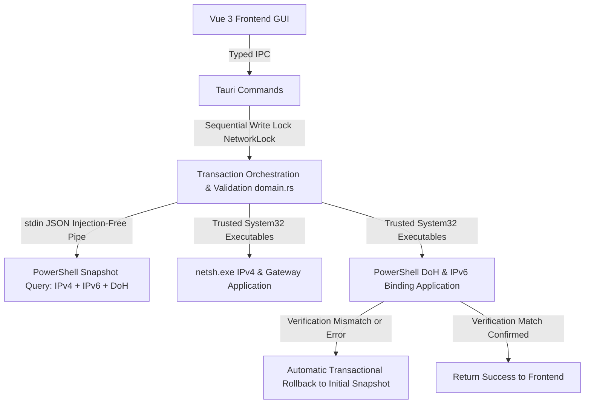

# 🛠️ WindowsNetworkConfigTool_DevDoc_EN.md

# 📝 Windows Network Configuration Tool - Developer Documentation (English)

## 🏁 1. Project Overview

This project is built using [Tauri](https://tauri.app/) (Rust) + [Vue 3](https://vuejs.org/) (TypeScript), designed to provide a secure, intuitive, and highly reliable network adapter configuration tool for Windows.
Users can view and configure:
- **IPv4 Address & Subnet Mask** (with strict non-leading-zero checks and contiguous binary mask validation).
- **Default Gateway** (with subnet reachability validation).
- **DNS Servers** (Primary and Secondary DNS dependency checks).
- **DNS over HTTPS (DoH)** (Off, Auto, Manual template URL, and unencrypted UDP fallback toggle).
- **IPv6 Protocol Component Binding** (Safely enable or disable adapter `ms_tcpip6` binding).
- **Public DNS & DoH Presets** (One-click fill for AliDNS, DNSPod, Cloudflare, and Google).
- **Secure Persistent History** (Versioned schema, max 10 records, independent storage fault isolation).

---

## 2. Architecture & Safety Guarantees



### 2.1 Technology Stack
- **Frontend**: Vue 3 Composition API (`<script setup lang="ts">`) + TypeScript + Vite, featuring responsive layout, accessible controls, and Windows 11 Fluent-style toggles.
- **Backend / Desktop Container**: Tauri 1 (Rust), enforcing separation of executable code and data parameters, compiled as a native lightweight Windows executable.

### 2.2 Core Safety & Reliability Features
- **Anti-Code-Injection (A-01)**: All system command executions utilize static, invariant scripts. Arguments are serialized as JSON and passed via standard input (`stdin`), completely eliminating PowerShell script concatenation vulnerabilities.
- **Trusted System32 Paths (A-12)**: Executables are strictly resolved using absolute system directories (`SystemRoot\System32\powershell.exe`, `netsh.exe`), eliminating PATH hijacking risks.
- **Transactional Rollback & Read-Back Verification (A-03)**: Captures a complete snapshot before any modification. After changes are applied, it continuously polls and reads back the system state. If any step fails or read-back verification fails, it restores the previous state atomically.
- **Global Mutex & Async Task Management (A-04)**: Protects all write operations using an in-process `NetworkLock` and a Windows named mutex to prevent concurrent write collisions.
- **Strict Semantic Network Validation (A-06)**: Validates standard IPv4 octets (no leading zeros), contiguous subnet masks, gateway in-subnet validity, and HTTPS protocol compliance for DoH templates.
- **Adapter Draft Isolation (A-08)**: Keeps distinct form drafts per adapter name to eliminate accidental cross-adapter overwrites.
- **Fault-Tolerant History Storage (A-09, A-10)**: Strict JSON schema validation (`schemaVersion: 1`). Corrupt records are isolated, and storage errors never falsely flag network configuration failures.

---

## 3. Project Structure

```
├── src/
│   ├── types/
│   │   └── network.ts            # DTO interface definitions (DohConfig, AdapterSnapshot)
│   ├── utils/
│   │   └── validation.ts         # IPv4, contiguous subnet mask, and gateway validation
│   ├── services/
│   │   └── networkClient.ts      # Typed Tauri IPC wrapper
│   ├── composables/
│   │   ├── useNetworkConfig.ts   # Adapter state, DoH/IPv6 draft isolation & apply logic
│   │   └── useConfigHistory.ts   # Local history validation, persistence & error isolation
│   ├── App.vue                   # UI layout, Fluent switches, and preset chips
│   └── main.ts                   # Vue application entry point
├── src-tauri/
│   ├── src/
│   │   ├── domain.rs             # Domain models, DoH/IPv4 algorithms & unit tests
│   │   ├── platform.rs           # Trusted paths, DoH/IPv6 management & rollback
│   │   ├── lib.rs                # Tauri command registration & write locks
│   │   └── main.rs               # Rust backend entry point
│   └── tauri.conf.json           # Tauri configuration with CSP security
├── docs/                         # Security audit and refactoring reports
├── releases/                     # Output directory for standalone portable executables
├── package.json                  # Dependencies and build scripts
├── vite.config.ts                # Vite configuration
├── build-app.bat                 # One-click Windows build batch script
├── 打包说明.md                   # Packaging guide (portable & installer)
└── README.md                     # Project summary
```

---

## 4. API Interface Contracts

### 4.1 Get Network Adapters
- **Command**: `get_network_adapters`
- **Input**: None
- **Output**: `Vec<AdapterInfo>`
```typescript
interface AdapterInfo {
  name: string;             // Adapter name (e.g. "Ethernet", "Wi-Fi")
  status: string;           // Formatted user-friendly status
  rawStatus?: string;       // Raw system status (Up, Disconnected, etc.)
  displayName?: string;     // Hardware device description
  interfaceIndex?: number;  // Interface index
  interfaceGuid?: string;   // Unique interface GUID
}
```

### 4.2 Get Current Adapter Snapshot
- **Command**: `get_current_config`
- **Input**: `{ adapterName: string }`
- **Output**: `AdapterSnapshot`
```typescript
interface DohConfig {
  mode: 'off' | 'auto' | 'manual'; // DoH mode
  template: string;                // HTTPS query template URL
  allowFallback: boolean;          // Allow fallback to unencrypted UDP
}

interface AdapterSnapshot {
  adapterName: string;
  interfaceIndex: number;
  interfaceGuid: string;
  status: string;
  dhcpEnabled: boolean;
  addresses: { ipAddress: string; prefixLength: number; mask: string }[];
  gateways: string[];
  dnsServers: string[];
  ip: string;
  mask: string;
  gateway: string;
  dns1: string;
  dns2: string;
  doh1?: DohConfig;       // Primary DNS DoH configuration
  doh2?: DohConfig;       // Secondary DNS DoH configuration
  ipv6Enabled?: boolean;  // IPv6 binding status (ms_tcpip6)
}
```

### 4.3 Apply Network Configuration Transactionally
- **Command**: `apply_adapter_ipv4_config`
- **Input**: `{ cfg: Ipv4Config }`
```typescript
interface Ipv4Config {
  adapter: string;
  ip: string;
  mask: string;
  gateway: string;        // Optional default gateway
  dns1: string;           // Optional primary DNS
  dns2: string;           // Optional secondary DNS
  doh1?: DohConfig;       // Optional primary DoH
  doh2?: DohConfig;       // Optional secondary DoH
  ipv6Enabled?: boolean;  // Optional IPv6 protocol binding switch
}
```
- **Output**: `OperationResult`
```typescript
interface OperationResult {
  success: boolean;            // Whether application & verification succeeded
  message: string;            // Detailed status message
  rolledBack: boolean;        // Whether automatic rollback was triggered
  rollbackMessage?: string;   // Description of rollback status
  snapshot?: AdapterSnapshot; // Verified snapshot after change
}
```

---

## 5. Development & Build

### 5.1 Install Dependencies
```bash
npm install
# Or with yarn:
# yarn install
```

### 5.2 Local Development (Frontend + Tauri Desktop Window)
```bash
npm run tauri dev
```

### 5.3 Frontend Only (Web Debugging)
```bash
npm run dev
```

### 5.4 Type Checking & Frontend Build
```bash
npm run typecheck
npm run build
```

### 5.5 Backend Tests
```bash
cd src-tauri
cargo test
cargo check
```

### 5.6 Build Release Portable Executable
Run the batch file in the root folder:
```cmd
build-app.bat
```
Or execute:
```bash
npm run build
cd src-tauri && cargo build --release
```
The output binary will be located at:
`src-tauri/target/release/tauri-vue-20250419.exe`.
