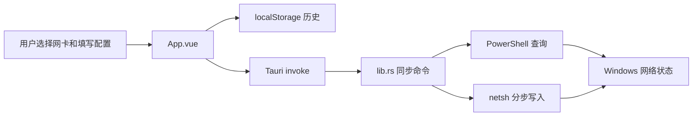
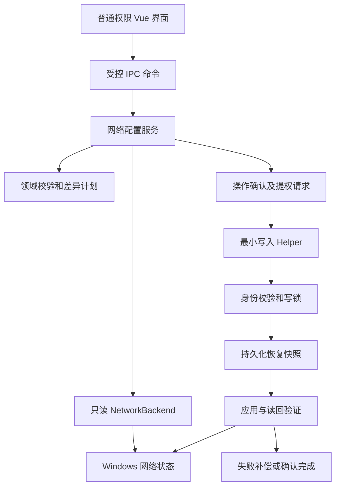
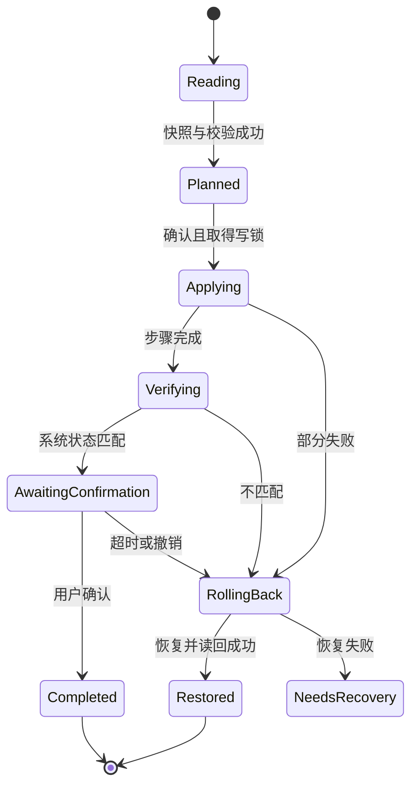

# Windows 网络配置工具项目重构报告

日期：2026-09-09  
适用基线：`2c6fdafbfb46aca96e68aa8eaffc5ea728f3d4de`  
依据：[项目审计文档](./项目审计文档-2026-09-09.md)、README、中英文开发文档与打包说明。本文为方案与估算，尚未实施。

## 1. 建议决策

**保留 Vue 3 + Rust + Tauri，采用渐进重构。** 项目规模小，核心难点在 Windows 网络配置的正确性、权限和恢复能力。全面改用 Electron、React、微服务或引入数据库，当前缺乏收益依据。

建议按以下顺序投入：

1. **恢复可重复构建，封闭 PowerShell 注入入口。** 当前 CLI 已因配置非法字段失败，名称也会进入脚本文本，属于下一次发布前必须处理的事项。
2. **把网络修改改成可观察、可验证、可恢复的操作。** 解决部分成功、错误提示、网卡切换误配置、阻塞 UI 等问题。
3. **协调迁移 Tauri 2 与受支持的前端工具链。** 获得更清晰的权限治理与维护路径，不将升级当成业务安全修复的替代品。
4. **在测量后替换系统查询实现。** 优先用 Windows API 替换只读查询，写入保留可控适配层，逐步验证后再切换。

基础整改建议预留 **12–20 人日**；如果只有一位同时熟悉 Vue、Rust 和 Windows 的维护者，考虑测试和发布缓冲，约 **3–5 周**。完整原生写入和更复杂的恢复机制可另加 **5–10 人日**。这是规划估算，需在目标 Windows 版本、32 位支持和权限方案确认后修订。

## 2. 当前架构与主要约束



源代码已经具有轻量应用所需的基本结构，不必推倒重来。需要改变的是以下边界：

| 当前方式 | 实际问题 | 目标方式 |
|---|---|---|
| 按名称定位网卡 | 名称可改、可含脚本字符，历史容易失效 | GUID 等稳定标识；执行时重新解析 index |
| 字符串式 IpConfig | 无 DHCP、保留/清空、多地址语义 | 有模式与操作意图的领域 DTO |
| 同步命令直接做系统工作 | UI 阻塞、不可取消、测试依赖本机 | 异步 command + backend 抽象 + 受控执行器 |
| IP/DNS 各自修改 | 部分失败后状态不明 | 变更计划、快照、串行应用、读回与补偿 |
| 所有失败合并成字符串 | 用户可能对已经成功的修改再次重试 | 类型化错误与独立持久化提示 |
| 整体管理员运行建议 | 前端问题影响范围更大 | 普通权限 UI，写入按需提权 |
| 手工打包和旧 EXE | 难以证明来源及兼容性 | 锁定构建、签名、版本化工件、CI |

本报告默认继续服务 **Windows 桌面**，先做 x64；Windows 最低版本、企业离线部署和 i686 是否仍为正式需求，应在第一阶段记录为决策。现有文档提到 32 位，因此不能在升级时无声移除该能力。

## 3. 技术迭代评估

核验时间为 2026-09-09。表中的主版本是路线建议，实施时再次检查维护状态、最低工具链和安全补丁；不要把本报告写成永久固定的版本清单。

| 技术方向 | 建议 | 项目实际收益 | 代价与注意点 |
|---|---|---|---|
| **Tauri 2** | 推荐，独立迁移阶段 | 配置和插件体系统一；可针对窗口、插件和命令定义权限 | Rust/JS/CLI/配置需协同迁移；旧 allowlist 不能直接照搬；自定义命令权限需显式配置 |
| **Vite 8 / Rolldown** | 推荐评估，先消除已知公告 | 跟进受支持工具链；可能减少开发/构建成本 | 现有项目单次构建仅 2.28 秒，绝对收益可能很小；验证 plugin-vue、visualizer、压缩和分块配置 |
| **Vue 3 受维护稳定补丁** | 保留并更新 | 当前锁文件实际上已有 Vue 3.5.13，可沿用熟悉的 Composition API | 不必为 10 条历史记录引入虚拟列表或复杂 store；升级后测模板和类型检查 |
| **windows-rs + IP Helper API** | 先做只读原型 | 消除重复 PowerShell 启动，避免文本编码与脚本拼接 | 需要处理缓冲区、返回码、地址生命周期、OS 版本及 unsafe 边界 |
| **固定 PowerShell 脚本 + JSON stdin** | 推荐作为过渡实现 | 成本较低，能复用 Windows cmdlet；把代码与参数分离 | 保留进程启动成本；统一错误/输出格式；严格禁止动态拼脚本 |
| **Rust DTO → TypeScript 类型生成（ts-rs）** | 推荐小规模采用 | 避免 IpConfig、AdapterInfo 和错误类型重复维护 | 生成类型不等于运行时验证；命令名及参数键仍需受控包装或契约测试 |
| **异步执行、结构化错误、tracing** | 推荐 | 保持 UI 响应，定位具体失败步骤和耗时 | 不能在 async 中继续直接阻塞；敏感网络信息需脱敏，限制日志体积 |
| **Vitest + Vue Test Utils** | 推荐 | 校验表单行为、历史损坏、网卡切换和状态提示 | 版本应与选定 Vite、Node 兼容；mock 测试不能代替 Windows 网络集成测试 |
| **Tauri store / SQLite** | store 按需；SQLite 暂缓 | 文件化配置便于备份与迁移 | 10 条配置用版本化 localStorage 已足够；store 默认不意味着加密 |
| **Pinia / VueUse** | 按需求加入 | 多视图共享状态或确有可复用逻辑时有帮助 | 当前单页可先用少量 composable，避免增加依赖治理负担 |
| **自动更新** | 延后 | 用户群扩大后便利 | 先完成签名、发布流水线、更新签名验证与回退策略 |
| **新框架整体重写、SSR、WASM、AI 自动改网络** | 当前不采用 | 无已测收益支持 | 会扩大重构范围；增加网络修改的不确定性 |

一手依据：Tauri 官方迁移指南要求协调 API、插件及权限变更；Vite 8 已以 Rolldown 统一构建流程。Vite 当日发布页列出 8.2 常规维护、7.3/8.1 重要修复，以及 6.4/8.0 安全回补，当前 6.3.2 不在受支持范围。厂商的大项目加速案例不能直接作为本项目的加速承诺。[Tauri 迁移](https://v2.tauri.app/start/migrate/from-tauri-1/)、[Vite 支持范围](https://vite.dev/releases)、[Vite 8 发布说明](https://vite.dev/blog/announcing-vite8)

原生 API 路线有官方基础：`GetAdaptersAddresses` 可枚举接口地址；`SetInterfaceDnsSettings` 的最低客户端为 Windows 10 Build 19041，因此必须先确定最低 Windows 版本，再决定动态探测、回退或提高支持下限。[GetAdaptersAddresses](https://learn.microsoft.com/en-us/windows/win32/api/iphlpapi/nf-iphlpapi-getadaptersaddresses)、[DNS API 要求](https://learn.microsoft.com/en-us/windows/win32/api/netioapi/nf-netioapi-setinterfacednssettings)、[windows-rs](https://github.com/microsoft/windows-rs)

类型和测试依据：[ts-rs](https://github.com/Aleph-Alpha/ts-rs)、[Vitest](https://vitest.dev/guide/)、[Vue Test Utils](https://test-utils.vuejs.org/)。Vue 官方强调基于测量选择优化；本项目不满足大规模响应式数据或长列表的典型场景。[Vue 性能指南](https://vuejs.org/guide/best-practices/performance)

## 4. 建议的目标结构

拆分到职责清楚、可以替换和测试即可，无需为小项目建立大量 crate。

```text
src/
  App.vue                         # 页面编排
  components/
    AdapterSelector.vue
    Ipv4ConfigForm.vue
    ConfigHistory.vue
    OperationStatus.vue
  composables/
    useNetworkConfig.ts           # 草稿、原始快照、请求状态
    useConfigHistory.ts           # 校验、迁移、持久化
  services/
    networkClient.ts              # 唯一 IPC 包装入口
    mockNetworkClient.ts          # 显式开发/测试替身
  generated/                      # Rust 导出的 DTO

src-tauri/src/
  lib.rs                          # 启动与命令注册
  commands/network.rs             # IPC 参数和错误映射
  domain/network.rs               # 地址、模式、校验、变更计划
  services/network_config.rs      # 事务式编排与恢复
  platform/windows/
    backend.rs                    # NetworkBackend trait 与实现
    process_runner.rs             # 可信路径、超时、输出上限
    snapshot.rs                   # 系统状态解析
  storage/recovery.rs             # 恢复记录
```

测试实现 `FakeNetworkBackend`，无需连接本机网络就能模拟“IP 成功、DNS 失败”“读取返回多地址”等情况。Windows API 或 PowerShell 只是 backend 的不同实现，不应泄漏到 Vue 组件。



helper 是中期权限隔离设计，并非现有功能。不要先增加永久管理员服务来解决小工具问题。优先评估短生命周期 helper；若要支持 UI 崩溃后的自动恢复，必须让恢复职责独立于 UI 生命周期。

## 5. 数据与命令契约

### 5.1 区分系统快照、用户意图和执行结果

| 类型 | 建议内容 |
|---|---|
| AdapterIdentity | 稳定 GUID、当前 interface index、显示名称；执行前重新验证对应关系 |
| AdapterSnapshot | DHCP 状态、IPv4 地址数组和前缀、默认路由/metric、DNS 模式与完整列表、链路/管理状态、读取时间和 revision |
| ConfigIntent | 目标 adapter ID、基线 revision、地址操作、网关操作、DNS 操作、requestId |
| ChangePlan | 规范化 before/after、受影响项、可逆操作、风险提示 |
| OperationResult | operationId、步骤结果、验证结果、是否已确认、回滚结果、结构化错误 |

当前字符串 DTO 缺少足够状态，不适合直接拿来做完整恢复快照。GUID 比名称稳定，但网卡重新安装后也可能改变，应将历史记录标记为“需要重新绑定”，不能自动改写到同名设备。interface index 不作为跨重启永久身份。

配置操作建议使用显式联合类型，以下只说明语义：

```typescript
type DnsChange =
  | { mode: 'keep' }
  | { mode: 'automatic' }
  | { mode: 'static'; servers: string[] };

type GatewayChange =
  | { mode: 'keep' }
  | { mode: 'remove' }
  | { mode: 'set'; address: string; metric?: number };
```

静态 DNS 数组必须非空，空字符串不再同时表示“保留”“清空”和“自动”。IPv4 变更须明确是替换某个地址还是替换整个地址集合，避免无意删除 VPN 或额外业务地址。

### 5.2 命令建议

第一阶段可保留旧命令名减少前端迁移成本；领域模型稳定后收敛为：

- `list_adapters` / `read_adapter_snapshot`：只读，普通权限。
- `plan_config_change`：规范化输入并生成可展示差异，不修改网络。
- `apply_config_change`：接收计划引用、基线 revision 和 requestId；后端重新验证，不信任前端传回的计划。
- `confirm_config_change` / `rollback_config_change`：确认新状态或请求恢复，受同等身份验证和写锁控制。

错误码至少包含 `ValidationFailed`、`AdapterChanged`、`PermissionDenied`、`TimedOut`、`ApplyFailed`、`VerificationFailed`、`RollbackFailed`。历史保存失败是 UI 持久化警告，与网络命令结果分离。

类型生成和编译检查解决字段漂移，不能阻止恶意 IPC。Rust 仍是权威校验入口。前端使用 `unknown` 解析错误，不用 `.includes('失败')` 决定业务状态。

## 6. 安全与可靠性设计

### 6.1 代码与参数彻底分离

短期使用签入仓库的固定脚本：可信绝对路径启动 PowerShell，设置非交互、UTF-8 和终止错误策略，从 stdin 读取有大小上限的 JSON，再调用固定 cmdlet。只接受白名单字段和已解析网卡标识。脚本不拼接用户内容，不动态 `Invoke-Expression`，不把 Base64 编码当注入防护。

系统程序路径从可信系统 API 获取，验证位数重定向；避免当前目录和环境 PATH 决定执行目标。日志不记录完整脚本拼接、任意 stdout 或原始 IPC，错误输出限长并转义控制字符。

长期通过原生 API 减少解释器参与。`GetAdaptersAddresses` 先解决只读枚举；IP、路由、DNS、DHCP 写入分别验证，不把某个 API 的存在等同于完整替代方案。禁止以直接写注册表作为缺少 API 研究的捷径。

### 6.2 应用、验证、确认与恢复



先实施必需的失败补偿与读回，再评估类似系统显示设置的确认倒计时。可先以 30–60 秒作为产品试验范围，真实时长由网卡和 DHCP 收敛测试决定。

恢复记录应包含修改前快照、变更步骤、操作 ID、版本和时间；写入前落盘，写入后更新进度。不要仅把新配置加入历史就称为备份。UI 崩溃或程序退出时，helper 仍应能按约定完成恢复或留下下次启动可处理的记录。

回滚必须防止覆盖其他管理员或系统服务的并发修改：确认当前状态仍匹配本次操作的中间结果；若不匹配，停止盲目覆盖并展示冲突。requestId 用于去重，不能代替系统状态复核。网络配置没有天然跨命令原子事务，产品应诚实展示部分结果。

网络连通检查作为辅助证据：网关 ping 可能被禁止，目标环境可能是离线专网；不要因无法访问某个公网域名就判定用户配置错误。系统状态读回和目标网络策略优先。

### 6.3 权限隔离和 Tauri 2

默认使用普通权限 UI。提升权限的 helper 只开放少量结构化网络操作，不能接受任意命令、程序路径或脚本文本。IPC 使用受限 ACL/当前用户身份校验、一次性请求关联和超时，必要时验证进程身份；不能把随机 token 作为唯一安全边界。helper 与恢复文件必须位于普通低权限进程无法替换的受控位置。

迁移 Tauri 2 后，对自定义命令通过 `AppManifest::commands` 等机制明确纳入权限约束，按窗口分配最小权限；审查 capability 叠加、远程 URL 和插件默认权限。仅建立 `capabilities/default.json` 不代表所有自定义命令已受限。[Tauri capabilities](https://v2.tauri.app/security/capabilities/)

CSP 分别覆盖开发与发行场景，验证本地脚本、样式、IPC 的必需来源；不直接复制宽泛策略。确认程序无依赖全局对象后关闭 `withGlobalTauri`，删去未用的 greet、opener、窗口操作权限。显式用户确认用于防止误操作，不能代替后端权限和参数验证。

## 7. 性能路线与测量方法

### 7.1 先优化有证据的路径

当前前端 gzip JavaScript 合计 26.45 kB，历史正常只有 10 条。为了这些数据引入虚拟列表、Web Worker、SSR 或大型状态库，优先级很低。现有 OnceLock 已缓存正则，也不需要再次以“缓存正则”作为主要性能优化。

首要优化目标是 **读取配置从三次 PowerShell 降为一次**，再评估原生查询降为零；同时把系统调用移出 UI 主线程。减少进程数可降低启动开销，但不会保证 Windows 服务本身更快。写入阶段优先保证正确性，不能为了速度并行修改相互依赖的 IP 和路由。

Rust 当前 `lto='fat'`、`opt-level='z'` 优先体积，可能增加编译成本。建立基线后比较 thin LTO / opt-level s 或 2 的成品体积、冷启动与构建时间，再决定。不要在网络命令占主耗时的应用中预设 CPU 编译参数能带来明显体验提升。

Vite 的压缩器、manualChunks 和 visualizer 应用实际数据取舍。visualizer 可放到独立 analyze 任务，避免每次构建改写已跟踪的 stats.html。明确 WebView2 最低版本后设置兼容构建 target，不默认将 esnext 当兼容承诺。

### 7.2 基准与验收预算

以下数字是**拟定验收目标，不是本次实测结果**：

| 指标 | 初始目标 | 测量方式 |
|---|---|---|
| 系统操作期间 UI 响应 | 不出现由命令导致的持续冻结；交互响应目标 <100 ms | 注入慢 backend + WebView 性能跟踪 |
| 读取进程数 | 过渡实现每次快照 ≤1；原生实现 0 | process runner 计数 |
| 读取时延 | 同机同网卡条件下 p95 较基线减少至少 30%，否则复查投入收益 | 预热后至少 30 次，不含 UAC |
| 子进程等待 | 查询初始上限 10 秒、写步骤初始上限 20 秒 | 故障注入；根据企业网络和 DHCP 行为调整 |
| JS/CSS 体积 | 默认不超过已测基线约 20%，超出需说明功能收益 | 每次 release 构建比较 gzip 和原始体积 |
| 稳态资源 | 100 次查询后进程数、句柄与工作集无持续增长趋势 | Windows 性能工具；允许正常缓存和抖动 |

记录机器、Windows/WebView2 版本、网卡数量、VPN/Hyper-V 状态、debug/release、冷/热启动；分开统计 UAC 等待、进程启动、系统调用和前端渲染。不要把单次 Vite 的 2.28 秒当成原生性能指标。

## 8. 分阶段实施计划

| 阶段 | 预计人日 | 核心工作 | 完成条件 | 回退方式 |
|---|---:|---|---|---|
| S0：基线和发布修复 | 2–3 | 修复非法配置、失效脚本和文档参数；锁定工具链；创建干净 Windows 构建；记录支持矩阵 | Tauri 配置通过，前端/原生构建路径可验证 | 独立提交回退；保留基线标签与旧成品来源说明 |
| S1：安全和正确性 | 3–5 | A-01、A-03、A-05～A-10；稳定标识、校验、草稿绑定、错误契约、读回和基本补偿 | 注入参数仅作数据；故障注入无误报；表单模式一致 | 保留旧配置读取兼容；网络状态靠恢复快照，不能靠 Git 回退 |
| S2：执行器与权限 | 3–5 | 异步/超时/清理/串行写锁、合并读取、CSP；最小提权 helper 原型与验证 | 挂起命令 UI 不冻结；超时无残留；普通读不提权 | backend 可切换到已经修复的安全实现，不能回到不安全拼接 |
| S3：框架升级与发布治理 | 4–7 | Tauri 2、受支持 Vite/Vue 工具链；命令权限；CI、签名、依赖复扫、用户数据迁移 | Windows 测试矩阵通过；签名工件可追溯；数据迁移可恢复 | 原子回退匹配版本的 JS/Rust/配置/锁文件；保存原始历史数据 |
| S4：可选深度迭代 | 5–10 | 原生写入、持久恢复 watchdog、更多网卡/配置模式 | 与旧 backend 读回结果一致，失败恢复通过 | 按功能逐步切换、保留受支持 backend |

S0 是 S1–S3 的基线；S1 的契约与测试先稳定，S2 再调整权限和执行方式，S3 完成协调升级。若 helper、32 位和离线安装要求较高，时间应靠近上界或单独拆期。代码量小不代表 Windows 网络组合测试成本低。

建议按可审查的变更拆提交：配置/构建修复、领域与测试、前端交互、backend 执行器、Tauri 迁移、发布流水线。每个提交解释新的行为和验证结果，避免一个大提交同时改变框架、UI、数据格式和系统 API。

## 9. 测试与发布门禁

### 9.1 自动测试

| 层级 | 重点场景 | 禁止的误替代 |
|---|---|---|
| Rust 领域单测 | IPv4、掩码、模式、差异计划、基线冲突、恢复计划 | 只测 regex 能通过，忽略网络语义 |
| backend 故障测试 | 每一步失败、超时、输出过大、坏 JSON、进程残留、并发请求 | 只用一直成功的 mock |
| Vue 组件测试 | HTML 必填、网卡切换、历史损坏、storage quota、部分成功提示 | 只调用函数，未验证表单约束 |
| IPC 契约测试 | 字段命名、未知字段、错误类型、未经授权窗口 | 只依赖 TypeScript 泛型 |
| Windows 集成测试 | 真实适配器枚举、设置、读回、恢复和 UAC | 用浏览器 mock 宣称系统功能通过 |

真实写入测试只在可恢复虚拟机和专用虚拟网卡执行，不使用日常机器的默认路由网卡。测试前保存宿主/虚拟机快照；验证 IP、DNS、路由与 DHCP 状态全部恢复，而非只检查能否访问互联网。

### 9.2 Windows 测试矩阵

- 维护者承诺的最低 Windows 版本与当前目标版本；x64 必测，i686 若保留则单独验证系统程序重定向、安装和 Rust target。
- 普通用户、管理员用户、UAC 同意/拒绝；helper 不可用或版本不匹配。
- 有线、无线、断链但启用、禁用、VPN、Hyper-V/虚拟网卡；中文、空格、引号名称；热拔插和改名。
- 0/1/多个 IPv4、DHCP→静态→DHCP、单/多 DNS、无/多网关及不同 metric。
- 离线专网、网关禁止 ICMP、网络服务失败；UI 关闭、helper 崩溃、断电后的恢复记录处理。
- 新装系统的 WebView2、已安装 runtime、离线安装；CSP 下打包资源加载。

### 9.3 CI 与交付

建立锁定安装、类型检查、前端测试、Rust fmt/Clippy/test、Windows 构建和依赖扫描。CI 固定 Node/Rust/包管理器版本；Actions 固定可信引用并使用最小 token 权限。签名任务仅用于受控发布，不向不可信 PR 暴露密钥。

发布工件应同时提供版本、提交 SHA、锁文件指纹、SHA-256、签名、SBOM 和简短变更/已知限制。依赖公告按开发阶段、构建阶段、Windows 运行时分类处置。扫描例外需有有效期与负责人；不能因命中跨平台包就一概忽略，也不能因锁文件包含包就宣称 Windows 可被利用。

## 10. 现有参考文档的更新方案

| 文档 | 建议更新 |
|---|---|
| README | 明确真实支持平台、最低 Windows/WebView2、权限流程、成功历史与预设的区别；链接新报告 |
| 中文开发文档 | 按实际命令名和 camelCase 参数更新；增加 backend、DTO、错误状态与恢复机制 |
| 英文开发文档 | 与中文同版本维护，避免保留失效 CLI 参数 |
| 打包说明 | 分清架构 `--target` 和包格式 `--bundles`；增加签名、依赖锁定和干净重建验证 |
| 新增架构决策记录 | 记录最低 OS、32 位范围、PowerShell/原生取舍、提权 helper、数据格式和回滚策略 |

本文不直接覆盖旧参考文档，避免把尚未实现的新架构写成当前能力。实施每一阶段时同步更新对应文档，并注明适用版本。

## 11. 首轮可执行任务清单

| 顺序 | 任务 | 对应审计项 | 交付物 |
|---:|---|---|---|
| 1 | 清理非法 Tauri 字段、失效脚本和错误命令 | A-02、A-14 | 可从干净检出构建的基线 |
| 2 | 网卡稳定 ID + 固定脚本数据通道 | A-01、A-12 | 无字符串注入的 backend 和输入测试 |
| 3 | 模式化配置 DTO、前后端校验、网卡草稿绑定 | A-05～A-08 | 无跨网卡误写的表单与契约 |
| 4 | 写入快照、串行执行、读回、错误和恢复记录 | A-03、A-09 | 部分失败可解释、可恢复的操作服务 |
| 5 | 异步/超时/合并查询与性能测量 | A-04 | 响应性和时延基线报告 |
| 6 | 历史校验迁移、CSP、命令权限、helper | A-10、A-11 | 数据兼容与权限边界验证 |
| 7 | 框架升级、依赖复核、测试和签名发布 | A-13、A-15、A-16 | 带证据的候选发布版本 |

每项关闭需要修复提交、测试证据和一次复核。参考审计编号跟踪即可，无需为该规模引入额外项目管理系统。
